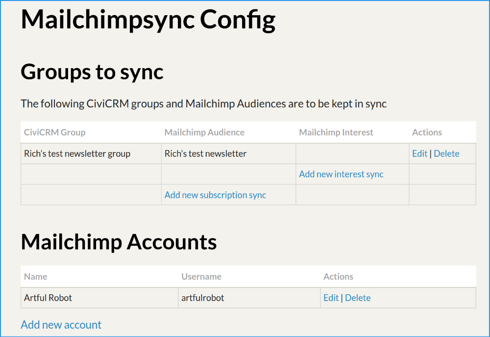

If you already have a CiviCRM group and a Mailchimp audience that you'd
like this extension to keep in sync, this page is for you.

## First: Backup

Backup your Mailchimp audience (export all via Mailchimp's website) and your
CiviCRM database before you begin. This extension deals with bulk updates to
data which can be costly if there's a mistake by you or a bug in the software.

## My group has contacts and my Audience has contacts...

Mailchimp records the last date that a member was updated. CiviCRM keeps
a record of when someone was added to (or removed from) a group.

This extension compares these two dates and whichever system has the later date
is considered to be the authoritative source of information.

For example:

Who          | Mailchimp            | CiviCRM          | Outcome
-------------|----------------------|------------------|-----------
Wilma        | subscribed 1 Jan     | added 5 Jan      | stays subscribed
Barney       | unsubscribed 2 Jan   | added 1 Jan      | gets removed from CiviCRM group
Fred         | subscribed 3 Jan     | removed 4 Jan    | gets removed from Mailchimp
Betty        | (does not exist)     | added 4 Jan      | gets added to Mailchimp
Pebbles      | added 1 Jan          | never in group   | gets added to CiviCRM

!!! important
    To be clear: this means that if you have removed people from the CiviCRM group then the sync will remove them from Mailchimp too (unless they were added at Mailchimp since this removal). So if you're already starting with a populated group and a populated audience, you should make sure you're confident of what's going to happen before you set up the sync connection.

## Set up the sync connection

Once you're confident (and you've made your backups!) you can add the sync connection by going to **Administer » System Settings » Mailchimp Sync**. Which looks like this:

From here you can

- Add a new Mailchimp account, if needed - most organisations only use one account, then
- **Add new subscription sync**

The next screen shows all your CiviCRM mailing groups and your Mailchimp audiences, so you can just select the correct ones, then ensure the webhooks are properly set up before pressing **Save**.

That's it! You can now wait for the sync. For the impatient, see [How to manually start a sync](/howto/run-sync.md).
