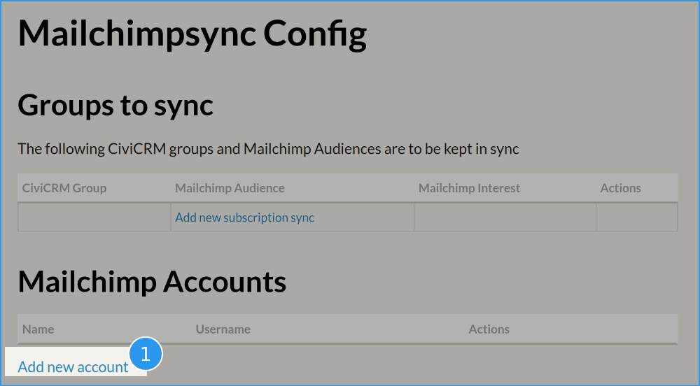

Everyone loves a quick start how-to!

## Backup

Both CiviCRM and Mailchimp.

!!! warning
    This extension can make huge changes to your data. Mailchimp's billing
    is based on the number of contacts - so if something goes wrong you
    can end up with a big bill. This software comes with absolutely no
    warranty nor any guarantee of it being fit for whatever processes you
    want it for. Proceed carefully at your own risk.

## Install

Install the extension in the normal way.

## Review scheduled jobs

Visit **Administer » System Settings » Scheduled Jobs**.

Look for "Call Mailchimpsync.Fetchandreconcile" and adjust it to suit your
needs. You might want to just disable it for now to avoid surprises.


## Link your Mailchimp account

Visit **Administer » System Settings » Configure Mailchimp Sync**.



Click ❶ **Add new account** and enter your Mailchimp API Key ([Mailchimp
help page about API Keys](https://mailchimp.com/help/about-api-keys/)) and
click **Save Account**.

There will be a pause while information is fetched from Mailchimp. You
should then see your account listed.


## Link a CiviCRM group with a Mailchimp Audience

Click the **Add new subscription sync** link and select the Audience and
the Group, then click **Save**.


## Optionally link interest(s) to group(s)

You can now follow a very similar process to link any Interests that are
configured (at Mailchimp) for your audience to other CiviCRM Mailing
Groups.

## Check out the status page

Visit **Mailings » Mailchimp Sync Status**. It should show something like
this:


- This lists all the linked groups-audiences and shows whether they are in
  sync or not.

- This screen refreshes itself every minute, but you can click the **Refresh**
  button to force a refresh.

Click the name of your list to see the details.


## Start a sync run

!!! warning
    Remember this talks to a real Mailchimp account and makes real changes.

You can wait for your schedule, trigger the scheduled job yourself from
the scheduled jobs page, or trigger it via the API, e.g.

```sh
cv api Mailchimp.fetchAndReconcile
```

## Monitor the status page


Here the status screen shows the following:

- The sync is still running/incomplete. It stopped processing because it
  ran out of time. Sync will continue when next triggered.
- I have 5 contacts at Mailchimp and in CiviCRM. Yay.
- There are currently no addition/removals waiting to be made, and there
  are no contacts that cannot be subscribed.


